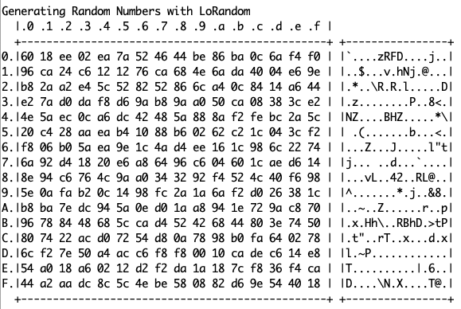
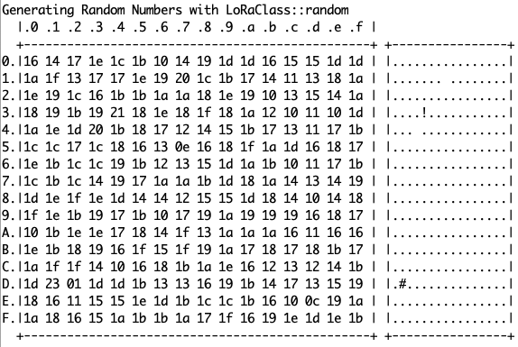

# ESP32 Random Test

A sample sketch demonstrating the problem in Sandeep Mistry's excellent LoRa library's `random()` function. See [this issue](https://github.com/sandeepmistry/arduino-LoRa/issues/394) for context.

This was written for ESP32, but is easily adaptable to other platforms.

See:

vs

